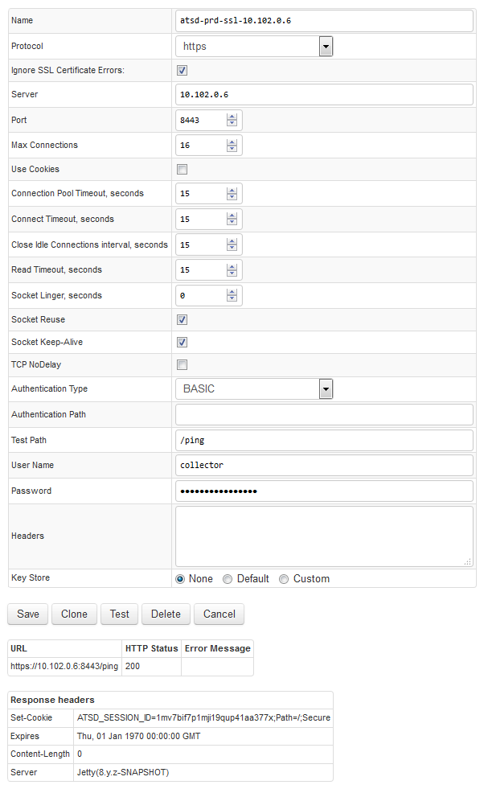
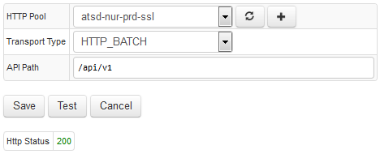

# ATSD Server Connection

## Overview

The primary function of Axibase Collector is to gather data from remote sources, to convert this data into a uniform format and to insert it into a target Axibase Time Series Database instance using series, properties and message commands. Axibase Collector serves as a data collection client/daemon and the number of Axibase Collector instances typically depends on the size of the environment and the amount of data collected by each instance.
Axibase Collector needs to have at least one ATSD server connection to function properly.

## HTTP Connection Pool

Since Axibase Collector transmits data into ATSD using http/s protocol you need to configure an HTTP connection pool by specifying connection properties as well as timeout and limit settings.

* Open **Data Sources:HTTP Pools:Add** form.
* Enter a pool name.
* Set connection parameters to the target ATSD instance: hostname/IP address; port (8443); https protocol.
* Check 'Ignore SSL Certificate Errors' to ignore certificate errors if ATSD certificate is self-signed.
* Apply connection limits using [recommended settings](#recommended-pool-settings) below.
* Select Authentication Type=BASIC, set Test Path to `/ping`, and enter ATSD user credentials. Make sure that this user has roles API_DATA_WRITE and API_META_WRITE as well as 'All Access: Write' permission. We recommend usign a dedicated [collector account](collector-account.md).

#### Test HTTP Pool

Click Test to verify the settings:

- Response code is 200 if connection is successful and credentials are valid.
- Response code is 401 if credentials are not valid.
- Response code is 403 if the specified user is not authorized to access the specified Test Path.

#### Recommended Pool Settings

**Setting** | **Value**
----- | ----- | -----
Max Connections | 16
Use Cookies | false
Connection Pool Timeout | 15
Connect Timeout | 15
Close Idle Connections interval | 60
Read Timeout | 15
Socket Linger | 0
Socket Reuse | true
Socket Keep-Alive | true

#### ATSD HTTP Pool Configuration Example

## ATSD Server configuration.

* Open **Admin:ATSD Servers:Add** page
* Choose ATSD HTTP pool configured previously
* Set Transport Type to **HTTP_BATCH**
* Keep API path as `/api/v1`
* Click Test. Response Code is 200 if connection was successful.

