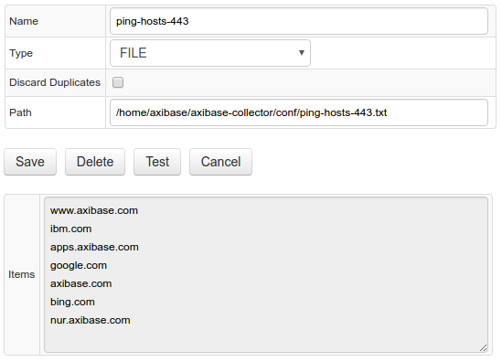
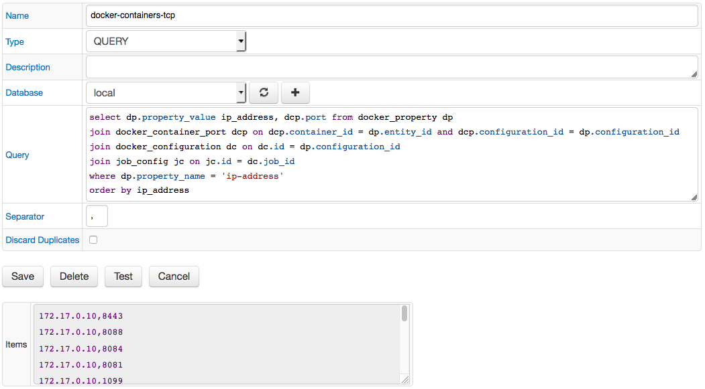
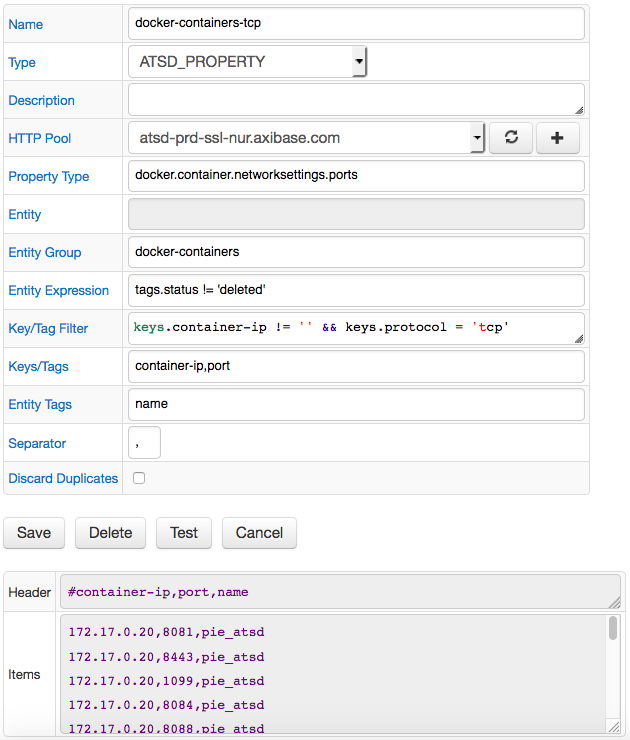

# Collections

## Item Lists

Item List is a collection of strings which can be iterated to execute repetitive requests (queries) within the same job configuration.

The list can be defined by specifying items as text (one item per line) or by retrieving them from an external source such as file or script output.

Items starting with the hash `#` symbol are treated as comments and are ignored.

Supported list types:

* [TEXT](#text)
* [FILE](#file)
* [SCRIPT](#script)
* [URL](#url)
* [QUERY](#query)
* [ATSD_PROPERTY](#atsd_property)

Job types with support for Item List automation:

* FILE
* JSON
* TCP
* ICMP
* OVPM
* SNMP

### Configuration

To create a new list, open the **Collections:Item Lists** page, and click **Add**:

| **Field** | **Description**|
|:----|:---|
|`Name` | Item List name.|
|`Description` | Item List description.|
| `Type` | Method used to retrieve list items. See [types](#types).|
|`Discard Duplicates` | Discard items with the same name.<br>If true, the list discards duplicate items regardless of type (TEXT, FILE, SCRIPT).<br>String comparison for duplicate checks is case-sensitive.|
|`Items`, `Path`, `Command`... | Type-specific fields to configure the source for reading list items.|
 
### Usage

Use the `${ITEM}` placeholder to access the value of the current item in the list while iterating. 

The items retain the original order as specified in the editor or returned by an external source.

For example, include the `${ITEM}` placeholder into the Path field in JSON job to query a different URL for each element in the list. 


### Functions

Item values can be further modified with built-in [string functions](jobs/placeholder.md#string-functions).

```ls
${ITEM?function(arguments)}
```

Example: `${ITEM?keep_before("_")}`

Multiple functions can be chained (executed from left to right):

```ls
${ITEM?functionA(arguments)?functionB(arguments)}
```

Example: `${ITEM?keep_before("_")?replace(".csv", "")}`

### Types

Item Lists may receive items from different sources. Currently the following types are implemented:

#### TEXT

An Item List which stores strings entered in the `Items` field on the form. 

List items should be separated by a line break.


#### FILE

Reads lines from a file on the local filesystem. 

Absolute path to the target file should be specified in the `Path` field. 

If the file is not found, an empty list is returned. List items in the file should be separated with a line break.



#### SCRIPT

Executes a script specified in the `Command` field and reads lines from a standard output as list items.

Only scripts in the `${COLLECTOR_HOME}/conf/scripts` directory can be executed.

The `Command` field should start with the script file name (absolute path not supported) and optional script arguments.

The script should print items separated by line breaks to 'stdout'.


**Example**

The directory `/tmp/report/csv` contains CSV files. The Item List should contain a collection of file name prefixes before the underscore symbol.

```
ent-1_file-1.csv
ent-1_file-2.csv
ent-1_file-3.csv
ent-2_file-1.csv
ent-2_file-2.csv
ent-3_file-3.csv
```

```
nano prefix.sh
```

```sh
#!/usr/bin/env bash
dir="$1/*"
for file in $dir; do
    if [[ -f $file &&  $file == *"_"* ]]; then
        filename=${file##*/}
        b=${filename%_*}
        echo -e "$b"
    fi
done
```

```
chmod a+x prefix.sh
prefix.sh /tmp/report/csv

ent-1
ent-1
ent-1
ent-2
ent-2
ent-3
```

#### URL

Reads lines from a remote file/page.

If the file is not found, an empty list is returned. List items should be separated with a line break.


***Example***

```
URL = http://m.uploadedit.com/ba3s/1490691073396.txt
```

Remote file content:

```
#ID
2128406
2513822
2513836
```

result:

```
2128406
2513822
2513836
```

#### QUERY

Selects data from a database with a SELECT query.

Each item is created by concatenating values from **all** columns in a given row separated by the specified token.

If the result set is empty, an empty list is returned.



#### ATSD_PROPERTY

Requests a list of property records from ATSD with the [property query](https://github.com/axibase/atsd/blob/master/docs/api/data/properties/query.md) method. 

Each item is created by concatenating field values (Keys/Tags + Entity Tags) separated by the specified token.

If no property records are found, an empty list is returned.


