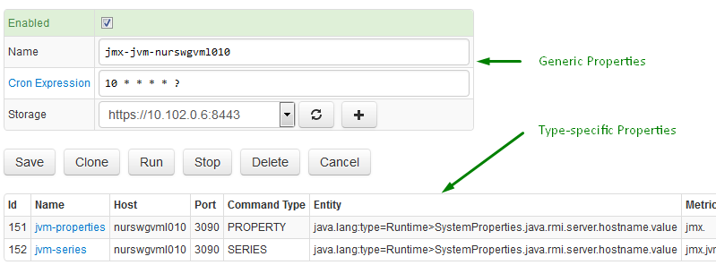

# Jobs

Job is a primary unit of configuration and scheduling in Axibase Collector. 

Each job has the following generic properties: 

| **Name** | **Description** |
|:--- |:---|
| Type | Job type, such as JDBC, JMX, FILE, etc.|
| Name | Job name. |
| Enabled | Job schedule status. The job must be enabled to be executed according to its schedule. |
| Cron Expression | Cron expression determines how frequently the job is executed. See [scheduling](https://github.com/atsd-collector-docs/scheduling.md).
| Storage | Target ATSD server for sending collected data. |

Type-specific properties, such as SQL query in JDBC job or CSV parser in FILE job, are specified in nested configuration objects.

```
+ job-1
  - configuration-1
+ job-2
  - configuration-2
  - configuration-3
...
```

The job may include multiple configurations, for example a JDBC job may be configured to execute multiple SQL queries.



## Scheduled Execution

Axibase Collector executes enabled jobs based on their schedule.

The number of concurrently executing jobs is set to 32 by default and is controlled with quartz.properties.

Jobs execute concurrently whereas configuration inside the same job are executed sequentially.

Instances of the same job cannot run at the same time. If the job is in STARTED status by the time it's time to execute it again, the new execution will not be triggered until the current job instance finishes its work.  

## Manual Execution

Jobs can be executed manually with `Run` action regardless of its schedule or status. 

Manual execution produces the same results as scheduled execution.

The manual mode is useful for running temporarily disabled jobs, for example when developing new jobs or troubleshooting existing jobs.

## Clonign Jobs

You can create the exact copy of the job by clicking Clone. <br>
The copied job will have the same name as the original job but with the '-cloned' postfix. 

By default, cloned jobs are disabled. 

You can change the necessary settings and enable the job by selecting the Enabled check box. 

Cloned job has its own primary key and can run concurrently with the original job.
