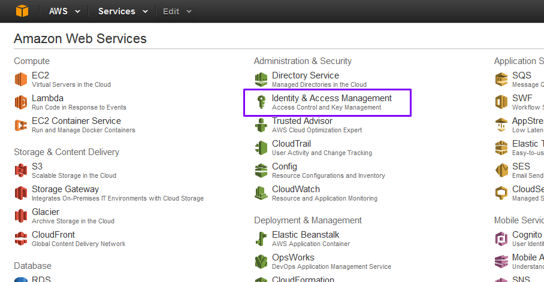
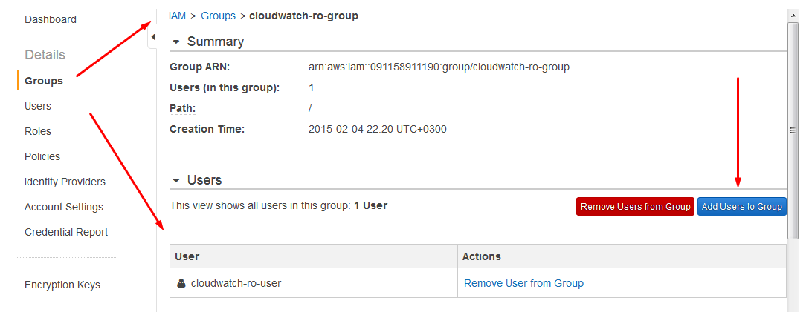

# AWS IAM Account for CloudWatch

## Overview

The following document describes the process of creating a read-only account used to query statistics from AWS CloudWatch API.

## Configuration Steps

### Login into the AWS Console and Select Identity and Access Management (IAM)




### Open the Groups Menu and Click [Create New Group].

Use a naming convention that would describe what this group is used for,
for example `cloudwatch-ro-group`.


### Open Users Menu and Click [Create New User].

Let the system generate access and secret key automatically. Copy
them for your reference.


### Open Group Menu Again and Click on Add Users to Group

Add `cloudwatch-ro-user` to the `cloudwatch-ro-group`.



### While on the Group Page, Scroll Down to Inline Policies and Click on [Create Another Policy]

Enter the following JSON text and save the policy.

```json
{
    "Version": "2012-10-17",
    "Statement": [
        {
            "Action": [
                "cloudwatch:Describe*",
                "cloudwatch:Get*",
                "cloudwatch:List*",
                "ec2:Describe*"
            ],
            "Effect": "Allow",
            "Resource": "*"
        }
    ]
}

```

### Save and Verify that the Policy is Correct.


### You Can now Query Amazon CloudWatch Monitoring Service HTTP APIs with the New User Account, Access Key, and Secret Key.
