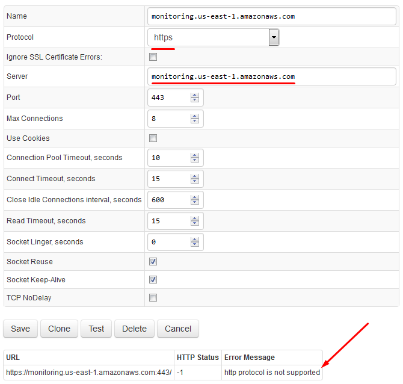

# AWS Job

AWS job allows you to collect data from [Amazon Web Services CloudWatch](https://aws.amazon.com/cloudwatch/) service and store it in ATSD.

## Configuration Settings

| Field        | Description    |
|:------------- |:--------------|
| Name   | Configuration name.    |
| HTTP Pool |  Pool of http connection used to execute API requests, points at one of CloudWatch [region endpoints](http://docs.aws.amazon.com/general/latest/gr/rande.html#cw_region).    |
| Endpoint  |  An endpoint is a URL that is the entry point for a web service. Amazon Web Services offer a regional endpoints that are helpful to reduce data latency in applications.   |
| Username  |  Username to interact with Amazon Web Services. |
| Access key id  |   Access key. For more information, see [Getting Your Access Key ID and Secret Access Key](http://docs.aws.amazon.com/AWSSimpleQueueService/latest/SQSGettingStartedGuide/AWSCredentials.html).   |
| Secret access key  | Secret access key. For more information, see [Getting Your Access Key ID and Secret Access Key](http://docs.aws.amazon.com/AWSSimpleQueueService/latest/SQSGettingStartedGuide/AWSCredentials.html).       |
| Namespaces  | CloudWatch metric namespaces including Default and Custom Namespaces. To minimize the number of requests, select namespaces for AWS services that you're actually using. For more information, see [AWS Namespaces](http://docs.aws.amazon.com/AmazonCloudWatch/latest/DeveloperGuide/aws-namespaces.html).   |
| Collect Status  |  Enable collection of service status metrics, for AWS services that expose such metrics.|
| Property Refresh Interval, minutes | Interval for refreshing properties about collected resources. |

## AWS Configuration Example

## HTTP(s) Pool Test 

When testing HTTP Pool configuration in https mode, a successful test will return **http protocol is not supported** message.
This is expected due to AWS CloudWatch endpoint redirect in case of GET request without API request.

