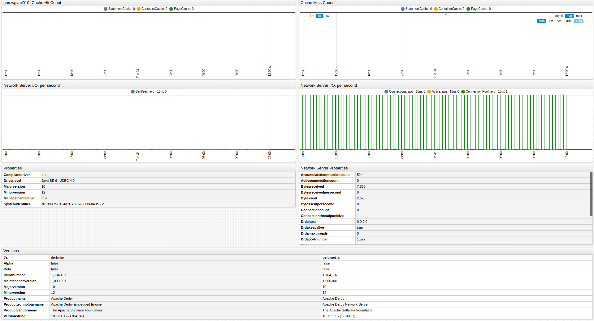

# Derby Database

## Overview

This document describes how to collect JMX metrics exposed by [Apache Derby Database](https://db.apache.org/derby/)  for long-term retention and monitoring in Axibase Time Series Database.

## Requirements

* Derby database `9+`

## Installation steps

### Enable JMX in Java application

Configure your Java applications for JMX monitoring as described [here](../../jmx.md).

### Import Derby job into Axibase Collector

 * Open **Jobs:Import** and upload [derby-job.xml](configs/derby_job.xml) file

### Configure Derby JMX Connection

* Open **Jobs:JMX** page, select `jmx-derby` job.
* For each JMX Configuration:
    * provide connection parameters to the target Derby as displayed below:
    
    * Click `Test` button and make sure that the result similar to the screenshot
    

### Schedule the Job

* Open `JMX Job` page and click `Run` button for the Derby JMX job.
* Make sure that the job status is `COMPLETED` and `Items Read` and `Sent commands` are greater than 0.

* If there are no errors, set job status to Enabled and save the job.

### Verify Metrics in ATSD

* Login into ATSD.
* Click on Metrics tab and filter metrics by name `jmx.derby*`.

## Viewing Data in ATSD

### Metrics

* List of collected [Derby metrics](metric-list.md)

### Properties

* List of collected [Derby properties](properties-list.md)

### Entity group

* Open **Admin:Entity Groups**, click `Import` button and upload  [derby_entity_group.xml](configs/derby_entity_group.xml)
* Select imported `apache-derby-databases` group
* Verify that the group contains your Derby hosts

### Entity Views

* Open **Configuration:Entity Views**, click `Import` button and upload  [derby_entity_view.xml](configs/derby_entity_view.xml)
* Select imported `	Apache Derby Databases` view
* Select Entity Group that you created earlier.
* Click on `View` button and browse information about your entities

### Portal

* Open **Configuration: Portals** click `Import` button and upload [derby_portal.xml](configs/derby_portal.xml).
* Click Assign link and associate the portal with the entity group you created earlier
* Open Entity tabs, find java application by name, and click on its portal icon

[**Derby Live Portal**](http://apps.axibase.com/chartlab/824dd915)

