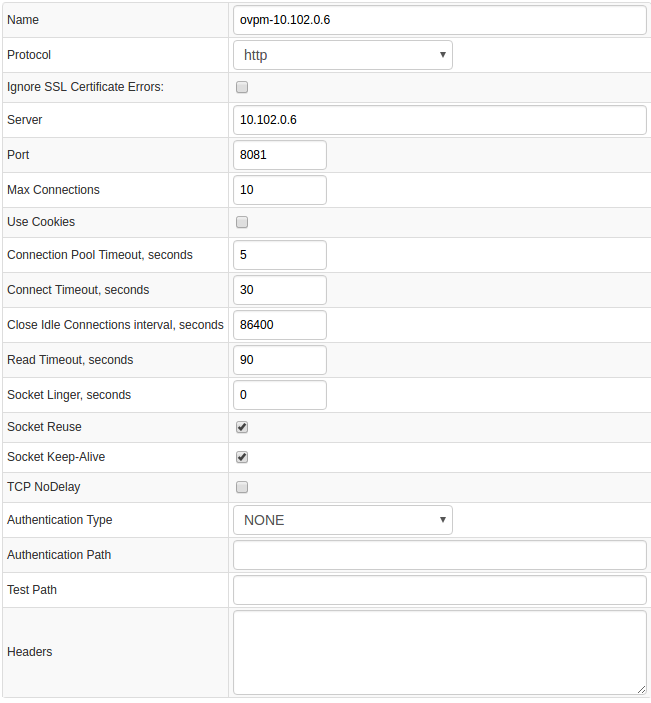
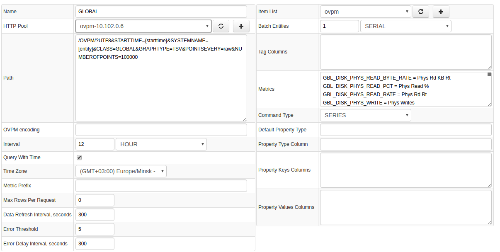

# HP OpenView
## Overview
[HP OpenView](https://h20392.www2.hp.com/portal/swdepot/displayProductInfo.do?productNumber=PERFMINFO "HP OpenView") software provides large-scale system and network management of an organization’s IT infrastructure.

Using ATSD you can retrieve metrics and properties from HP OpenView.

## Requirements

- HP OpenView `9.+`

## Installation steps

### Import HP OpenView JDBC job
* Open **Jobs:Import** and upload [collector-jobs-ovpm-jobs.xml](collector-jobs-ovpm-jobs.xml) file

### Configure HP Open View HTTP Pool

* Open **Data Sources:HTTP Pools** page, select `ovpm-10.102.0.6` database.
* Provide connection parameters to the target HP OpenView pool as displayed below:

### Verify Job Configuration

* Open `ovpm-global` job
* Set HTTP Pool to `ovpm-10.102.0.6`

* Choose one of target ATSD instances if your Collector instance is connected to multiple ATSD servers.
* Save the Job

* Open each configuration, click on `Test` button and review output. See [Data Queries](#data-queries) below.

<!---

-->

### Schedule the Job

* Open `JDBC Job` page and click `Run` button for the `ovpm-global` job.
* Make sure that the job status is `COMPLETED` and `Items Read` and `Sent commands` are greater than 0.

* If there are no errors, set job status to Enabled and save the job

### Verify Metrics in ATSD

* Login into ATSD
* Click on Metrics tab and filter metrics by name 'gbl_.*'

## Viewing Data in ATSD

### Metrics
* List of collected [HP OpenView metrics](metric-list.md)

<!--- ### Properties
* List of collected [HP OpenView properties](properties-list.md)
-->

## Entity group list
- OVPM Linux
- OVPM Unix
- OVPM Windows

## Portal List

[OVPM Portal](http://axibase.com/chartlab/f9d176ac/2/)

