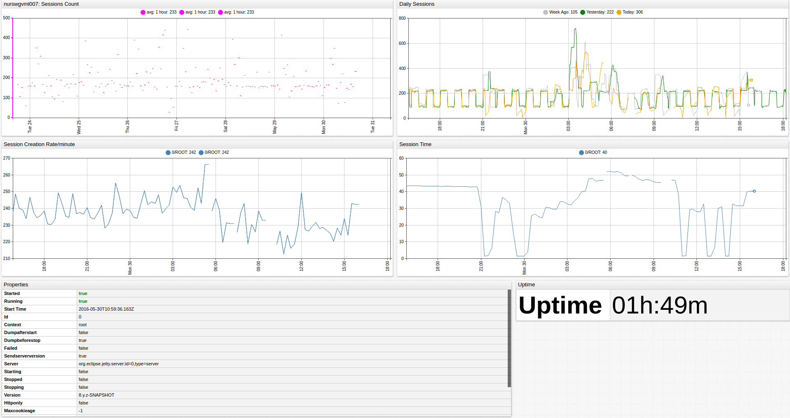

# Jetty Web Server

## Overview

This document describes how to collect JMX metrics introduced in [Jetty (Web server)](http://www.eclipse.org/jetty/) 10.10+ based applications for long-term retention and monitoring in Axibase Time Series Database.

## Requirements

Jetty web server`10.10+`

## Installation steps

### Enable JMX in Jetty based application

Configure your Jetty based application for jmx connection. Configuration procedure is described [here](../../jmx.md).

### Import Jetty job into Axibase Collector

 * Open **Jobs:Import** and upload [jetty-job.xml](configs/jetty_job.xml) file

### Configure Jetty JMX Connection

* Open **Jobs:JMX** page, select `jmx-jetty` job.
* For each JMX Configuration:
    * provide connection parameters to the target Jetty as displayed below:
    
    * Click `Test` button and make sure that the result similar to the screenshot
    

### Schedule the Job

* Open `JMX Job` page and click `Run` button for the Jetty JMX job.
* Make sure that the job status is `COMPLETED` and `Items Read` and `Sent commands` are greater than 0.

* If there are no errors, set job status to Enabled and save the job

### Verify Metrics in ATSD

* Login into ATSD
* Click on Metrics tab and filter metrics by name `jmx.jetty*`

## Viewing Data in ATSD

### Metrics

* List of collected [Jetty metrics](metric-list.md)

### Properties

* List of collected [Jetty properties](properties-list.md)

### Entity group

* Open **Admin:Entity Groups**, click `Import` button and upload  [jetty_entity_group.xml](configs/jetty_entity_group.xml)
* Select imported `jetty-web-server` group
* Verify that the group contains your Jetty hosts

### Entity Views

* Open **Configuration:Entity Views**, click `Import` button and upload  [jetty_entity_view.xml](configs/jetty_entity_view.xml)
* Select imported `Java Applications` view
* Select Entity Group that you created earlier.
* Click on `View` button and browse information about your entities

### Portal
* Open **Configuration: Portals** click `Import` button and upload [jetty_portal.xml](configs/jetty_portal.xml).
* Click Assign link and associate the portal with the entity group you created earlier
* Open Entity tabs, find java application by name, and click on its portal icon

**Jetty Portal**
