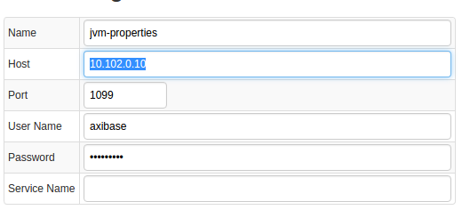

# Java Virtual Machine

## Overview

This document describes how to collect JMX metrics introduced in [Java Virtual Machine (JVM)](https://docs.oracle.com/javase/specs/jvms/se7/html/) 6+ based applications for long-term retention and monitoring in Axibase Time Series Database.

## Requirements

Java Virtual Machine `6+`

## Installation steps

### Import JVM job into Axibase Collector

 * Open **Jobs:Import** and upload [jmx-jvm-job.xml](configs/jvm_job.xml) file

### Configure JMV JMX Connection

* Open **Jobs:JMX** page, select `jmx-jvm` job.
* For each JMX Configuration:
    * provide connection parameters to the target JVM as displayed below:
    
    * Click `Test` button and make sure that the result similar to the screenshot
    

### Schedule the Job

* Open `JMX Job` page and click `Run` button for the JVM JMX job.
* Make sure that the job status is `COMPLETED` and `Items Read` and `Sent commands` are greater than 0.

* If there are no errors, set job status to Enabled and save the job

### Verify Metrics in ATSD

* Login into ATSD
* Click on Metrics tab and filter metrics by name `jmx.jvm*`

## Viewing Data in ATSD

### Metrics

* List of collected [JVM metrics](metric-list.md)

### Properties

* List of collected [JVM properties](properties-list.md)

### Entity group

* Open **Admin:Entity Groups**, click `Import` button and upload  [jvm_entity_group.xml](configs/jvm_entity_group.xml)
* Select imported `java-virtual-machine` group
* Verify that the group contains your JVM hosts

### Entity Views

* Open **Configuration:Entity Views**, click `Import` button and upload  [jvm_entity_view.xml](configs/jvm_entity_view.xml)
* Select imported `Java Applications` view
* Select Entity Group that you created earlier.
* Click on `View` button and browse information about your entities

### Portal
* Open **Configuration: Portals** click `Import` button and upload [jvm_portal.xml](configs/jvm_portal.xml).
* Click Assign link and associate the portal with the entity group you created earlier
* Open Entity tabs, find java application by name, and click on its portal icon

**JVM Portal**

### Rules

* Open **Configuration: Rules** page, click `Import` button and upload [jvm_rules.xml](configs/jvm_rules.xml).
* For each created rules: open it  in the Rule Editor and change recipient address on the *Email Notifications* tab.