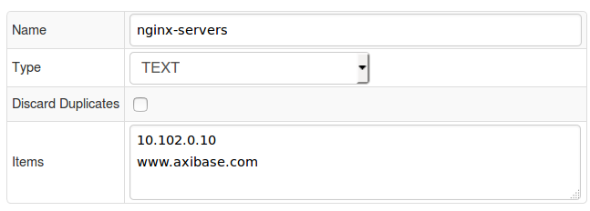

# NGINX Web Server Monitoring

## Overview

This document describes how to collect connection and request metrics from an NGINX web server for long-term retention and monitoring in Axibase Time Series Database.

The process involves enabling NGINX status page and configuring Axibase Collector to poll and upload this page every 5 seconds for parsing in ATSD.

## Requirements

* NGINX server with [ngx_http_stub_status_module](http://nginx.org/en/docs/http/ngx_http_stub_status_module.html) enabled.
* [Axibase Collector](https://github.com/axibase/axibase-collector-docs/blob/master/README.md) for scheduled polling of the NGINX status page.
* [Axibase Time Series Database](https://github.com/axibase/atsd-docs/blob/master/installation/README.md) as a centralized data repository.

## NGINX Server Configuration

Follow the steps outlined in [NGINX server configuration guide](./nginx-configure.md) to enable metrics on its status page.

The status page returns connection statistics in an unstructured/malformed format, which is parsed by ATSD with [RFC 7111](https://axibase.com/products/axibase-time-series-database/writing-data/csv/csv-schema/) selectors using whitespace as a separator.

```ls
Active connections: 291
server accepts handled requests
 16630948 16630948 31070465
Reading: 6 Writing: 179 Waiting: 106
```

```javascript
select("#row=1").select("#col=3").
addSeries().
metric(cell(row, 1) + '_' + (cell(row,col-1)+'').substring(0,(cell(row,col-1)+'').length-1));
...
```

## Import NGINX CSV parser configuration into ATSD

* Login into ATSD web interface.
* Open **Configuration:Parsers CSV** page. Click Import.
* Import [CSV parser](./configs/nginx-atsd-csv-parser.xml) for NGINX status page.  
* The parser splits status page content into cells and assembles series commands from extracted cell values.<br>In addition, it creates a derived metric `unhandled_percent` equal to `100*(1-handled/accepted)`.

## Configure jobs in Axibase Collector

Axibase Collector will poll the NGINX status page every 5 seconds and upload the downloaded file into ATSD for parsing. Moreover, Axibase Collector will try to establish a TCP connection with the same period to check availability of the server. 

* Login into Axibase Collector web interface

### Create Item List for NGINX servers

* Open **Collections:Item Lists** page
* Add a new TEXT [Item List](/collections.md) named **nginx-servers** containing DNS names or IP addresses of the monitored NGINX servers, one server per line. <br>Make sure that each server on the list is accessible on the specified protocol and port and exposes the status page on the same path `/nginx_status`. <br>If the protocols and ports are different, move the entire url to the list and set Path field to equal `${ITEM}` placeholder.
* **Save** the list.
 


### Import jobs

* Import [nginx-collector-jobs.xml](./configs/nginx-collector-jobs.xml) job on **Jobs:Import** page.
* Open the `nginx-statistics` FILE job. 
* If 'Storage' drop-down is set to `None`, select the target ATSD server.
* Set Status to Enabled.
* **Save** the job.
* Open the `nginx-connect-check` TCP job. 
* If 'Storage' drop-down is set to `None`, select the target ATSD server.
* Set Status to Enabled.
* **Save** the job.

### Validate Data Availability

* Open `nginx-status` configuration in `nginx-statistics` job.
* Click Test to verify processing.


* Open `nginx-connect` configuration in `nginx-connect-check` job.
* Click Test to verify processing.


* Login into ATSD web interface.
* Open Metrics tab and apply `nginx*` name mask to view nginx metrics received by ATSD.
* Click on Series link and check that metrics are present for each server in in the **nginx-servers** list.


### NGINX Status Page Metrics

| Metric                  |                                      Description                                        |
|:-----------------------:|:----------------------------------------------------------------------------------------|
| Active connection       |The current number of active client connections including Waiting connections.           |
| Server accepts          |The total number of accepted client connections.                                         |
| Server handled          |The total number of handled connections.<br> The parameter is lower than accepts if resource limits have been reached (for example, the worker_connections limit).                          |
| Server requests         |The total number of client requests.                                                     |
| Reading                 |The current number of connections where nginx is reading the request header.             |
| Writing                 |The current number of connections where nginx is writing the response back to the client.|
| Waiting                 |The current number of idle client connections waiting for a request.                     |
 
# Viewing Data in ATSD 

## Metrics

List of collected [NGINX server metrics](./nginx-basic-server-metrics.md)

## Portals

* [Basic NGINX portal](http://apps.axibase.com/chartlab/f09f853a)


## Notifications

You can monitor key NGINX statistics by creating a rule in ATSD rule engine to send an email notification in case of abnormal conditions. 

For example, you can send an email if average *Active Connections* count over the last 15 minutes on a target NGINX server drops below the specified threshold.

### Setting up Mail Client

* Configure [Mail Client](https://github.com/axibase/atsd-docs/blob/master/administration/setting-up-email-client.md).

### Import rules

* Download an [xml file](./configs/nginx_notification_rules.xml) containing the rules.
* Open **Configuration: Rules** page.
* Click *Import* and attach nginx_notification_rules.xml file.
* Open created rules in the Rule Editor and change recipient address on the *Email Notifications* tab.
* These rules will automatically apply to all NGINX servers monitored by Axibase Collector

The following rules are provided in the nginx_notification_rules.xml file:

| **Rule**                                     |                                      **Description**                        |
|:----------------------------------------:|:------------------------------------------------------------------------|
|nginx_unhandled_percent_high| Raise an alert when an NGINX server unhandled connection percentage is above 2%.|
| nginx_active_connections_low | Raise an alert when an NGINX server average Active Connection count is below 10 over the last 15 minutes.|
| nginx_active_connections_heartbeat| Raise an alert when status page statistics are no longer being received by ATSD.<br> Check that the server is reachable and Axibase Collector job is running. |
|nginx_tcp_heartbeat| Raise an alert when TCP connect metric is no longer being received by ATSD or if tcp connect metric contains error codes.<br>Check that the server is reachable and Axibase Collector job is running.|

To create your own rules, refer to [Rule Engine documentation](https://github.com/axibase/atsd-docs/blob/master/rule-engine/rule-engine.md). 

