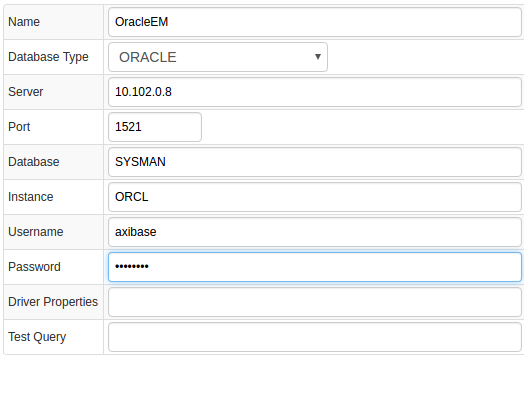
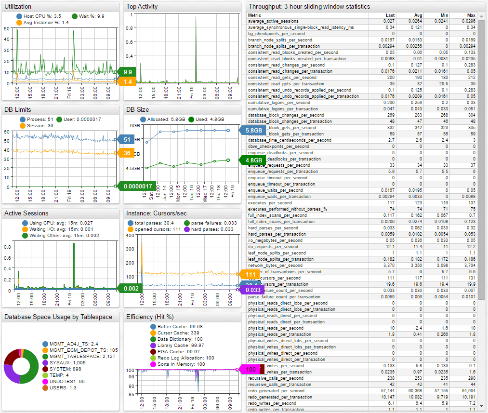

# Oracle Enterprise Manager

## Overview

[Oracle Enterprise Manager](http://www.oracle.com/us/products/enterprise-manager/index.html "Oracle Enterprise Manager") (Oracle EM) is a distributed application for centralized monitoring, diagnosing, and resolving issues related to Oracle products.

Oracle EM collects and stores statistics from remote databases, applications, and systems in an Oracle database (`SYSMAN.gc$metric_values` table) which Axibase Collector queries every 15 minutes to offload incremental data into Axibase Time Series Database for the purpose of long-term retention and operations analytics.

## Supported versions

- Oracle Enterprise Manager `11+`

## Installation steps

### Import Oracle EM JDBC job

* Open **Jobs:Import** and upload [oracle-em-jobs.xml](oracle-em-jobs.xml) file

### Configure Oracle EM Database Connection

* Open **Data Sources:Databases** page, select `OracleEM` database. 
* Provide connection parameters to the target Oracle EM database as displayed below:



* Read-only/SELECT privileges to `SYSMAN.GC$TARGET` and `SYSMAN.gc$metric_values` tables are sufficient.
* Execute the following test query to check the connection:

```SQL
SELECT NULL FROM dual
```

* Click on `Meta Data` button and check that **SYSMAN** schema is present in the list of schemas.

### Verify Job Configuration

* Open Oracle EM JDBC job
* Set Data Source to OracleEM


* Choose one of target ATSD instances if your Collector instance is connected to multiple ATSD servers.
* Save the Job
* Open each configuration, click on `Test` button and review output. See [Data Queries](#data-queries) below.


### Schedule the Job

* Open `JDBC Job` page and click `Run` button for the Oracle EM JDBC job. 
* Make sure that the job status is `COMPLETED` and `Items Read` and `Sent commands` are greater than 0.


* If there are no errors, set job status to Enabled and save the job

### Verify Metrics in ATSD

* Login into ATSD
* Click on Metrics tab and filter metrics by name 'oem.*'


## Viewing Data in ATSD

### Metrics

* List of collected [Oracle EM metrics](metric-list.md)

### Entity Groups

- Oracle EM Databases
- Oracle EM Hosts

### Portals

* [Oracle Databases Portal](https://axibase.com/chartlab/32a3fe3e)



* [Oracle Host Portal](https://axibase.com/chartlab/32a3fe3e/2/)
 


## Data Queries

* Metrics Queries select most recent statistics 

```SQL
SELECT ENTITY_NAME, ENTITY_TYPE || '.' || REPLACE(REPLACE(METRIC_GROUP_LABEL, ',', ' '), ' ', '_') || '.' ||
REPLACE(REPLACE(TRIM(REPLACE(REPLACE(REPLACE(REPLACE(METRIC_COLUMN_LABEL, ' - ', '-'), ',', ' '), ')', ' '), '(', ' ')), ' ', '_'), '__', '_') AS METRIC,
NULLIF(KEY_PART_1, '%') AS KEY, NULLIF(KEY_PART_2, '%') AS KEY_2, NULLIF(KEY_PART_3, '%') AS KEY_3, NULLIF(KEY_PART_4, '%') AS KEY_4,
NULLIF(KEY_PART_5, '%') AS KEY_5, NULLIF(KEY_PART_6, '%') AS KEY_6, NULLIF(KEY_PART_7, '%') AS KEY_7, COLLECTION_TIME_UTC, VALUE
FROM SYSMAN.gc$metric_values
WHERE ENTITY_TYPE = 'oracle_database' AND METRIC_GROUP_LABEL_NLSID IS NOT NULL AND COLLECTION_TIME_UTC >= ? ORDER BY COLLECTION_TIME_UTC
```

```SQL
SELECT ENTITY_NAME, ENTITY_TYPE || '.' || REPLACE(REPLACE(METRIC_GROUP_LABEL, ',', ' '), ' ', '_') || '.' ||
REPLACE(REPLACE(TRIM(REPLACE(REPLACE(REPLACE(REPLACE(METRIC_COLUMN_LABEL, ' - ', '-'), ',', ' '), ')', ' '), '(', ' ')), ' ', '_'), '__', '_') AS METRIC,
NULLIF(KEY_PART_1, '%') AS KEY, NULLIF(KEY_PART_2, '%') AS KEY_2, NULLIF(KEY_PART_3, '%') AS KEY_3, NULLIF(KEY_PART_4, '%') AS KEY_4,
NULLIF(KEY_PART_5, '%') AS KEY_5, NULLIF(KEY_PART_6, '%') AS KEY_6, NULLIF(KEY_PART_7, '%') AS KEY_7, COLLECTION_TIME_UTC, VALUE
FROM SYSMAN.gc$metric_values
WHERE ENTITY_TYPE = 'host' AND COLLECTION_TIME_UTC >= ? ORDER BY COLLECTION_TIME_UTC
```
* Properties Query selects current properties 

```SQL
SELECT 'oem.' || TARGET_TYPE AS TTYPE, TARGET_NAME, HOST_NAME, DISPLAY_NAME, TIMEZONE_REGION, TYPE_QUALIFIER1 AS TYPE
FROM SYSMAN.GC$TARGET
WHERE TARGET_TYPE IN ('host', 'oracle_database')
```


