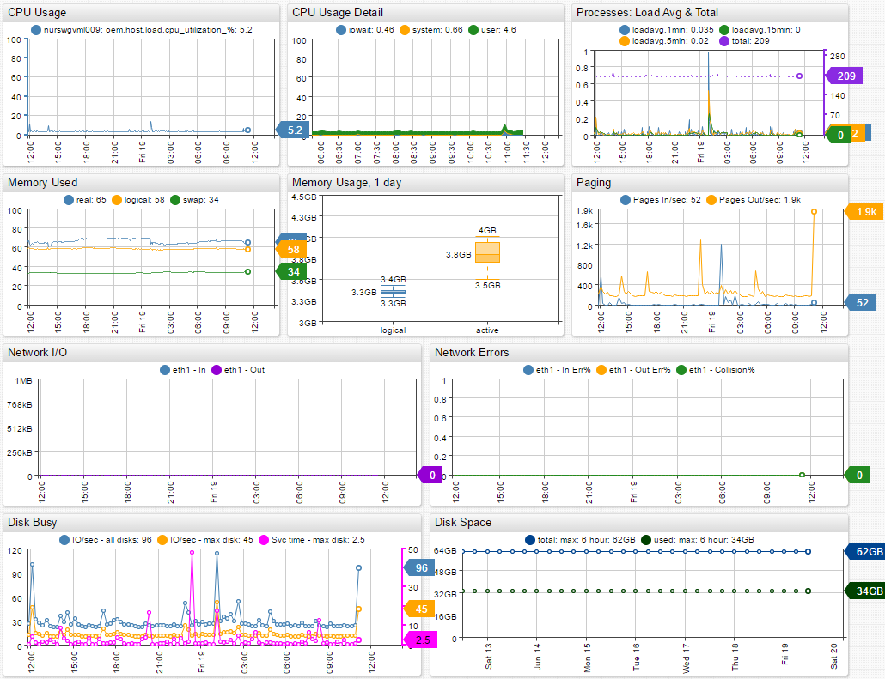

# Oracle Enterprise Manager
## Overview
[Oracle Enterprise
Manager](http://www.oracle.com/us/products/enterprise-manager/index.html "Oracle Enterprise Manager") is
a set of web-based tools aimed at managing software and hardware
produced by Oracle Corporation as well as by some non-Oracle entities.

## Supported versions

- Oracle Enterprise Manager 11+.

## Installation steps
### Setting up database connection
> Log in Axibase collector interface and go to Datatsources->Databases->Add. Fill form's fields like screenshot above:


Now verify that connection is ok by executing following test SQL query:
```SQL
SELECT NULL FROM dual
```
You can see `SYSMAN` schema in returned schema list

### Job files

You can download the oem-jobs.xml file and import it from the Jobs tab in Axibase Collector for a quick setup. Be sure to select your ATSD server and Data Source after you have imported the collector job xml file.
> [oracle-em-jobs.xml](oracle-em-job.xml)

#### Queries

This file contains two jobs with different queries to Oracle database.

#### Metric


- Query 1

```SQL
SELECT ENTITY_NAME, ENTITY_TYPE || '.' || REPLACE(REPLACE(METRIC_GROUP_LABEL, ',', ' '), ' ', '_') || '.' ||
REPLACE(REPLACE(TRIM(REPLACE(REPLACE(REPLACE(REPLACE(METRIC_COLUMN_LABEL, ' - ', '-'), ',', ' '), ')', ' '), '(', ' ')), ' ', '_'), '__', '_') AS METRIC,
NULLIF(KEY_PART_1, '%') AS KEY, NULLIF(KEY_PART_2, '%') AS KEY_2, NULLIF(KEY_PART_3, '%') AS KEY_3, NULLIF(KEY_PART_4, '%') AS KEY_4,
NULLIF(KEY_PART_5, '%') AS KEY_5, NULLIF(KEY_PART_6, '%') AS KEY_6, NULLIF(KEY_PART_7, '%') AS KEY_7, COLLECTION_TIME_UTC, VALUE
FROM SYSMAN.gc$metric_values
WHERE ENTITY_TYPE = 'oracle_database' AND METRIC_GROUP_LABEL_NLSID IS NOT NULL AND COLLECTION_TIME_UTC >= ? ORDER BY COLLECTION_TIME_UTC
```

- Query 2

```SQL
SELECT ENTITY_NAME, ENTITY_TYPE || '.' || REPLACE(REPLACE(METRIC_GROUP_LABEL, ',', ' '), ' ', '_') || '.' ||
REPLACE(REPLACE(TRIM(REPLACE(REPLACE(REPLACE(REPLACE(METRIC_COLUMN_LABEL, ' - ', '-'), ',', ' '), ')', ' '), '(', ' ')), ' ', '_'), '__', '_') AS METRIC,
NULLIF(KEY_PART_1, '%') AS KEY, NULLIF(KEY_PART_2, '%') AS KEY_2, NULLIF(KEY_PART_3, '%') AS KEY_3, NULLIF(KEY_PART_4, '%') AS KEY_4,
NULLIF(KEY_PART_5, '%') AS KEY_5, NULLIF(KEY_PART_6, '%') AS KEY_6, NULLIF(KEY_PART_7, '%') AS KEY_7, COLLECTION_TIME_UTC, VALUE
FROM SYSMAN.gc$metric_values
WHERE ENTITY_TYPE = 'host' AND COLLECTION_TIME_UTC >= ? ORDER BY COLLECTION_TIME_UTC
```

#### Properties

```SQL
SELECT 'oem.' || TARGET_TYPE AS TTYPE, TARGET_NAME, HOST_NAME, DISPLAY_NAME, TIMEZONE_REGION, TYPE_QUALIFIER1 AS TYPE
FROM SYSMAN.GC$TARGET
WHERE TARGET_TYPE IN ('host', 'oracle_database')
```

## Verifying configurations
After importing jobs you need to verify that it works
### Check that job is imported
> Go to Jobs->JDBC, find and open imported job.  Check that choosen database is right.


## Metric list
You can view full list of this product [here](metric-list.md)

## Entity group list
Entities collecting Oracle Enterprise Manager data are automatically grouped in ATSD.

Oracle Enterprise Manager entity group names:

- Oracle EM Databases
- Oracle EM Hosts


## Portal List
Default visualization portals for Oracle Enterprise Manager entities are included in ATSD.
Default Oracle Enterprise Manager portal names:
##### Live Oracle Databases Portal in Axibase Chart Lab.

[Launch](http://axibase.com/chartlab/32a3fe3e)


##### Oracle Host Portal


##### Live Oracle Host Portal in Axibase Chart Lab.

[Launch](http://axibase.com/chartlab/32a3fe3e/2/)

