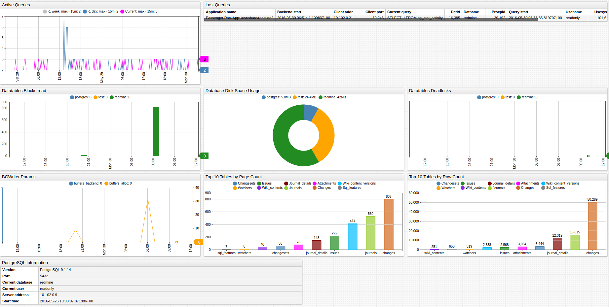

# PostgreSQL

## Overview

This document describes how to collect statistics' metrics introduced in [PostgreSQL](http://www.mysql.com/) 9.1+ for long-term retention and monitoring in Axibase Time Series Database.

The process involves enabling a JDBC job in Axibase Collector to poll [statistics views](https://www.postgresql.org/docs/9.1/static/monitoring-stats.html) in PostgreSQL database and uploading the counters and properties into ATSD for processing.

## Requirements

- PostgreSQL `9.1+`

## Installation Steps

## Create a readonly user for Axibase Collector

* Create user
```sh
adduser readonly
```

* Login as `postgres` user and open `psql` console

```sh
sudo su postgres
psql
```

* Run the following commands in `psql` console

```sql
CREATE ROLE readonly;
GRANT SELECT ON ALL TABLES IN SCHEMA public TO readonly;
ALTER USER readonly WITH PASSWORD 'readonly';
ALTER USER readonly VALID UNTIL 'infinity';
ALTER ROLE readonly login;
```

* Open file **/etc/postgresql/${POSTGRES_VERSION}/main/pg_hba.conf**
* Add the following record to allow remote access from Axibase Collector machine:

```
host    all             readonly        10.102.0.12           trust
```

* Open file **/etc/postgresql/${POSTGRES_VERSION}/main/postgresql.conf**
* Enable the database to accept remote connections by specifying its external IP address:

```
listen_addresses = 'localhost,10.102.0.9'		# what IP address(es) to listen on;
```

### Import PostgreSQL job into Axibase Collector

* Open **Jobs:Import** and upload [postgres-jobs.xml](postgres-jobs.xml) file

### Configure PostgreSQL Database Connection

* Open **Data Sources:Databases** page, select `10.102.0.9` database.
* Provide connection parameters to the target PostgreSQL database as displayed below:


* Execute the following test query to check the connection:

```SQL
SELECT 1
```
* Query result must be `Query OK`.

### Verify Job Configuration

* Open PostgreSQL job
* Set Data Source to `10.102.0.7`


* Choose one of target ATSD instances if your Collector instance is connected to multiple ATSD servers.
* Save the Job
* Open each configuration, click on `Test` button and review output. See [Data Queries](#data-queries) below.


### Schedule the Job

* Open `JDBC Job` page and click `Run` button for the PostgreSQL JDBC job.
* Make sure that the job status is `COMPLETED` and `Items Read` and `Sent commands` are greater than 0.


* If there are no errors, set job status to Enabled and save the job

### Verify Metrics in ATSD

* Login into ATSD
* Click on Metrics tab and filter metrics by name `postgres.*`


## Viewing Data in ATSD

### Metrics

* List of collected [PostgreSQL metrics](metric-list.md)

### Properties

* List of collected [PostgreSQL properties](properties-list.md)

### Entity Groups

* Open **Admin: Entity Groups** page
* Create a new Entity Group, click on Expression 'Edit mode' and enter the following expression:

```javascript
hasMetric('postgres.global_status.uptime')
```

* Save and verify that the group contains your PostgreSQL database hosts


### Portals

* Open **Configuration: Portals** page and import a postgres portal from [portal-postgres.xml](portal-postgres.xml).
* Click Assign link and associate the portal with the entity group you created earlier
* Open Entity tabs, find postgres database by name, and click on its portal icon


[PostgreSQL Portal](http://apps.axibase.com/chartlab/faf6be23)



## Data Queries

Metrics Queries select most recent statistics described in this [file](data-queries.md).


