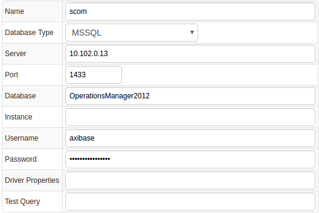
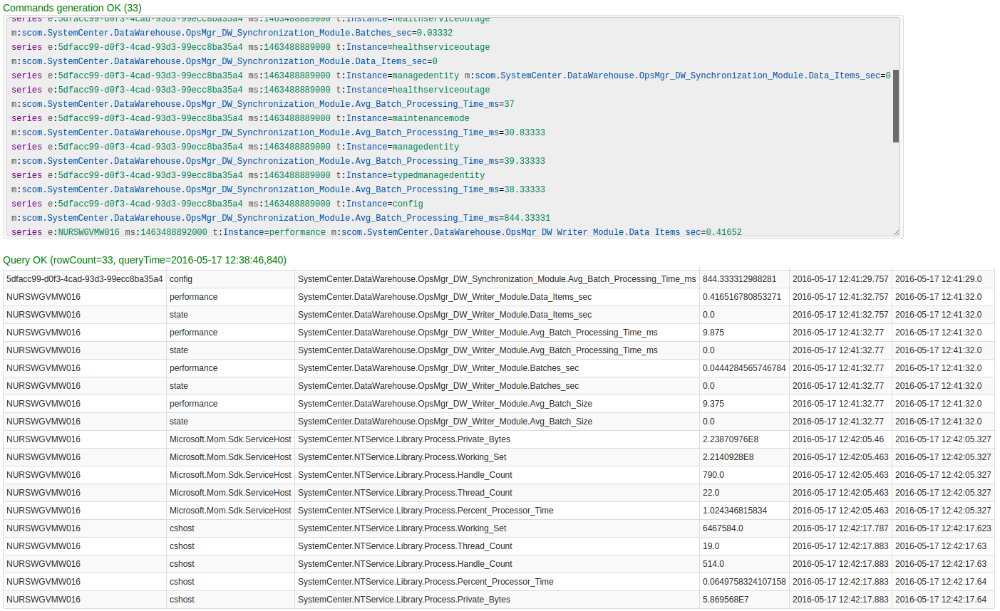
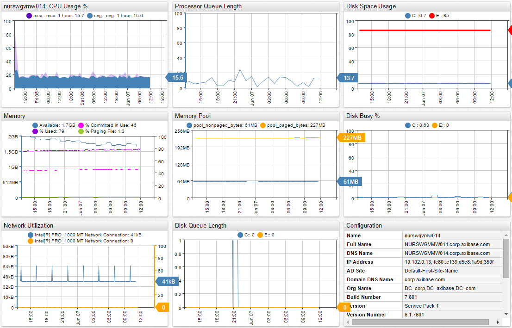
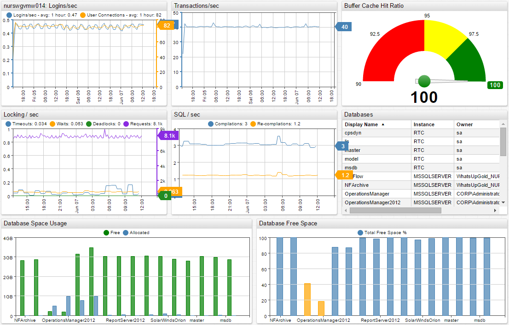

# Microsoft System Center Operations Manager

## Overview

[Microsoft System Center Operations Manager
(SCOM)](http://www.microsoft.com/en-us/server-cloud/products/system-center-2012-r2/ "Microsoft SCOM")
is a agent-based monitoring system for Microsoft Windows operating system and applications that run on it.

SCOM collects and stores statistics from Windows servers in Operations (`PerformanceDataAllView`) and DataWareHouse (`vperf_raw`, `vperf_hourly`, `vperf_daily`) database views.

Axibase Collector queries `PerformanceDataAllView`in SCOM Operations database view every 30 minutes to offload incremental data into Axibase Time Series Database for long-term retention and operations analytics.

## Requirements

- Microsoft System Center Operations Manager 2012+.

## Installation steps

### Import Microsoft SCOM JDBC job

* Open **Jobs:Import** page and upload [collector-jobs-scom-jobs.xml](collector-jobs-scom-jobs.xml) file

### Configure Microsoft SCOM Database Connection

* Open **Data Sources:Databases** page, select `scom` database.
* Provide connection parameters to the target `scom-2012` database as displayed below:



* Execute the following test query to check the connection:

```SQL
SELECT 1
```

* Query result must be `Query OK`.


### Verify Job Configuration

* Open SCOM job
* Set Data Source to `scom`.


* Choose one of target ATSD instances if your Collector instance is connected to multiple ATSD servers.
* Save the Job
* Open each configuration, click on `Test` button and review output. See [Data Queries](#data-queries) below.



### Schedule the Job

* Open `JDBC Job` page and click `Run` button for the Microsoft SCOM JDBC job.
* Make sure that the job status is `COMPLETED` and `Items Read` and `Sent commands` are greater than 0.


* If there are no errors, set job status to Enabled and save the job.

### Verify Metrics in ATSD

* Login into ATSD
* Click on Metrics tab and filter metrics by prefix 'scom.*'


## Viewing Data in ATSD

### Metrics

* List of collected [Microsoft SCOM metrics](metric-list.md)

### Properties

* List of collected [Microsoft SCOM properties](properties-list.md)

### Entity Groups

-   `scom-servers`
-   `scom-databases`

### Portals

* [SCOM Server Portal](http://axibase.com/chartlab/693b4f8d)



* [SCOM SQL Server](http://axibase.com/chartlab/693b4f8d/2/)




## Data Queries
[Data queries](data-queries.md) that offload recent metrics and properties.
