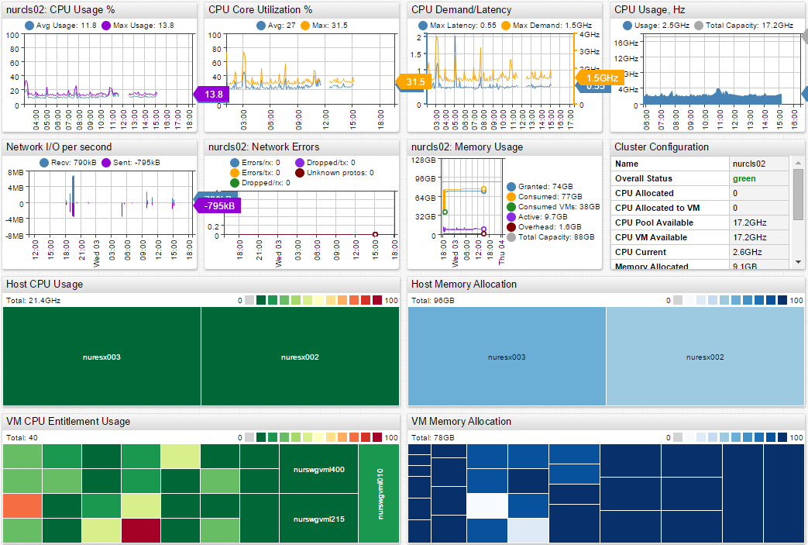
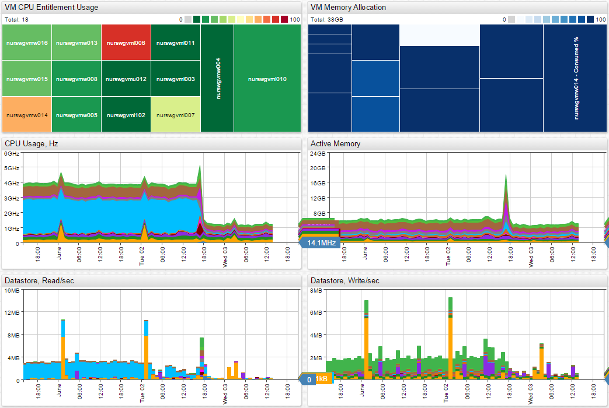

# VMware

## Overview

[VMware](http://www.vmware.com/ "VMware") provides cloud and
virtualization software and services.

Using ATSD you can retrieve metrics and properties from VMware.

## Requirements

- VMware `6+`

## Installation steps

### Import Oracle EM JDBC job

* Open **Jobs:Import** and upload [collector-jobs-vmware-jobs.xml](collector-jobs-vmware-jobs.xml) file

### Configure Oracle EM Database Connection

* Open **Data Sources:Databases** page, select `sql-vmware` database.
* Provide connection parameters to the target VMware database as displayed below:


* Execute the following test query to check the connection:

```SQL
SELECT 1
```

* Query result must be is `Query OK`.


### Verify Job Configuration

* Open Oracle EM JDBC job
* Set Data Source to sql-vmware.


* Choose one of target ATSD instances if your Collector instance is connected to multiple ATSD servers.
* Save the Job
* Open each configuration, click on `Test` button and review output. See [Data Queries](#data-queries) below.


### Schedule the Job

* Open `JDBC Job` page and click `Run` button for the Oracle EM JDBC job.
* Make sure that the job status is `COMPLETED` and `Items Read` and `Sent commands` are greater than 0.


* If there are no errors, set job status to Enabled and save the job

### Verify Metrics in ATSD

* Login into ATSD
* Click on Metrics tab and filter metrics by name 'vmware.*'


## Viewing Data in ATSD

### Metrics

* List of collected [VMware metrics](metric-list.md)

### Properties
* List of collected [VMware properties](properties-list.md)

### Entity Groups

- VMware VMs
- VMware Hosts
- VMware Clusters

### Portals

* [VMware Cluster Portal](http://axibase.com/chartlab/36ae5c9e/3/)



* [VMware Host Portal](http://axibase.com/chartlab/36ae5c9e)


* [VMware Host VMs](http://axibase.com/chartlab/36ae5c9e/2/)



* [ VMware VM Portal](http://axibase.com/chartlab/36ae5c9e/4/)


## Data Queries

* Metrics Queries select most recent statistics

```SQL
SELECT st.SAMPLE_TIME, pe.NAME AS ENTITY_NAME, (sd.GROUP_NAME + '.' + sd.NAME) AS METRIC,
COUNT(hs.STAT_VAL) AS "cnt",
AVG(CASE sd.UNIT WHEN 'percent' THEN hs.STAT_VAL/100.0 ELSE hs.STAT_VAL END) AS "avg",
SUM(CASE sd.UNIT WHEN 'percent' THEN hs.STAT_VAL/100.0 ELSE hs.STAT_VAL END) AS "sum",
MAX(CASE sd.UNIT WHEN 'percent' THEN hs.STAT_VAL/100.0 ELSE hs.STAT_VAL END) AS "max",
MIN(CASE sd.UNIT WHEN 'percent' THEN hs.STAT_VAL/100.0 ELSE hs.STAT_VAL END) AS "min"
FROM dbo.VPX_SAMPLE_TIME1 AS st (NOLOCK)
INNER JOIN dbo.VPX_HIST_STAT1 AS hs (NOLOCK)
INNER JOIN dbo.VPX_STAT_COUNTER AS sc (NOLOCK) ON hs.COUNTER_ID = sc.COUNTER_ID
INNER JOIN dbo.VPX_STAT_DEF AS sd (NOLOCK) ON sc.STAT_ID = sd.ID
INNER JOIN dbo.VPX_DEVICE AS d (NOLOCK)
LEFT OUTER JOIN dbo.VPX_STAT_DEV_TYPE AS sdt (NOLOCK) ON d.DEVICE_ID = sdt.DEVICE_ID
LEFT OUTER JOIN dbo.VPX_STAT_DEV_TYPE_DEF AS sdtd (NOLOCK)
ON sdt.DEVICE_TYPE_ID = sdtd.DEVICE_TYPE_ID ON sc.DEVICE_ID = ISNULL(d.DEVICE_ID, 1)
ON st.TIME_ID = hs.TIME_ID
INNER JOIN dbo.VPX_STAT_ID AS si (NOLOCK) ON sc.ENTITY_ID = si.ID
INNER JOIN VPXV_ENTITY_MOID em (NOLOCK) on si.MOID = em.MOID
INNER JOIN VPXV_ENTITY e (NOLOCK) on em.ENTITYID = e.id
INNER JOIN VPXV_ENTITY pe (NOLOCK) on e.parent_id = pe.id
WHERE sd.GROUP_NAME NOT IN ('sys', 'rescpu') AND st.SAMPLE_TIME > DATEADD(MINUTE, -10, ?)
AND ISNULL(d.DEVICE_ID, 1) = 1 AND e.PARENT_ENTITY_TYPE = 'CLUSTER_COMPUTE_RESOURCE'
AND sd.UNIT != 'millisecond'
GROUP BY pe.NAME, st.SAMPLE_TIME, sd.GROUP_NAME, sd.NAME, sd.UNIT
HAVING COUNT(hs.STAT_VAL) > 1
ORDER BY SAMPLE_TIME
```

```SQL
SELECT st.SAMPLE_TIME, e.NAME AS ENTITY_NAME, LOWER(e.ENTITY_TYPE) AS ENTITY_TYPE,
(sd.GROUP_NAME + '.' + sd.NAME) AS METRIC, d.DEVICE_NAME,
CASE sd.UNIT WHEN 'percent' THEN hs.STAT_VAL/100.0 ELSE hs.STAT_VAL END AS STAT_VALUE
FROM dbo.VPX_SAMPLE_TIME1 AS st (NOLOCK)
INNER JOIN dbo.VPX_HIST_STAT1 AS hs (NOLOCK)
INNER JOIN dbo.VPX_STAT_COUNTER AS sc (NOLOCK) ON hs.COUNTER_ID = sc.COUNTER_ID
INNER JOIN dbo.VPX_STAT_DEF AS sd (NOLOCK) ON sc.STAT_ID = sd.ID
INNER JOIN dbo.VPX_DEVICE AS d (NOLOCK)
LEFT OUTER JOIN dbo.VPX_STAT_DEV_TYPE AS sdt (NOLOCK) ON d.DEVICE_ID = sdt.DEVICE_ID
LEFT OUTER JOIN dbo.VPX_STAT_DEV_TYPE_DEF AS sdtd (NOLOCK)
ON sdt.DEVICE_TYPE_ID = sdtd.DEVICE_TYPE_ID ON sc.DEVICE_ID = ISNULL(d.DEVICE_ID, 1)
ON st.TIME_ID = hs.TIME_ID
INNER JOIN dbo.VPX_STAT_ID AS si (NOLOCK) ON sc.ENTITY_ID = si.ID
INNER JOIN VPXV_ENTITY_MOID em (NOLOCK) on si.MOID = em.MOID
INNER JOIN VPXV_ENTITY e (NOLOCK) on em.ENTITYID = e.id
WHERE sd.GROUP_NAME != 'sys' AND e.PARENT_ID IS NOT NULL AND e.ENTITY_TYPE != 'VM' AND st.SAMPLE_TIME > DATEADD(MINUTE, -10, ?)
ORDER BY st.SAMPLE_TIME
```

```SQL
SELECT st.SAMPLE_TIME, e.NAME AS ENTITY_NAME, LOWER(e.ENTITY_TYPE) AS ENTITY_TYPE,
(sd.GROUP_NAME + '.' + sd.NAME) AS METRIC, d.DEVICE_NAME,
CASE sd.UNIT WHEN 'percent' THEN hs.STAT_VAL/100.0 ELSE hs.STAT_VAL END AS STAT_VALUE
FROM dbo.VPX_SAMPLE_TIME1 AS st (NOLOCK)
INNER JOIN dbo.VPX_HIST_STAT1 AS hs (NOLOCK)
INNER JOIN dbo.VPX_STAT_COUNTER AS sc (NOLOCK) ON hs.COUNTER_ID = sc.COUNTER_ID
INNER JOIN dbo.VPX_STAT_DEF AS sd (NOLOCK) ON sc.STAT_ID = sd.ID
INNER JOIN dbo.VPX_DEVICE AS d (NOLOCK)
LEFT OUTER JOIN dbo.VPX_STAT_DEV_TYPE AS sdt (NOLOCK) ON d.DEVICE_ID = sdt.DEVICE_ID
LEFT OUTER JOIN dbo.VPX_STAT_DEV_TYPE_DEF AS sdtd (NOLOCK)
ON sdt.DEVICE_TYPE_ID = sdtd.DEVICE_TYPE_ID ON sc.DEVICE_ID = ISNULL(d.DEVICE_ID, 1)
ON st.TIME_ID = hs.TIME_ID
INNER JOIN dbo.VPX_STAT_ID AS si (NOLOCK) ON sc.ENTITY_ID = si.ID
INNER JOIN VPXV_ENTITY_MOID em (NOLOCK) on si.MOID = em.MOID
INNER JOIN VPXV_ENTITY e (NOLOCK) on em.ENTITYID = e.id
WHERE sd.GROUP_NAME != 'sys' AND e.PARENT_ID IS NOT NULL AND e.ENTITY_TYPE = 'VM' AND st.SAMPLE_TIME > DATEADD(MINUTE, -10, ?)
ORDER BY st.SAMPLE_TIME
```
* Properties Query selects current properties
```SQL
SELECT pe.NAME AS CLUSTER, vms.NAME as VM, e.NAME AS HOST, vms.POWER_STATE,
vms.MEM_SIZE_MB, vms.NUM_VCPU, vms.DESCRIPTION
FROM VPXV_ENTITY e (NOLOCK)
INNER JOIN VPXV_ENTITY pe (NOLOCK) on e.parent_id = pe.id
INNER JOIN VPXV_VMS vms (NOLOCK) on vms.hostid = e.id
WHERE e.PARENT_ENTITY_TYPE = 'CLUSTER_COMPUTE_RESOURCE' AND e.ENTITY_TYPE = 'HOST'
AND VMS.POWER_STATE = 'On'
```


```SQL
SELECT pe.NAME AS CLUSTER, vms.NAME as VM, e.NAME AS HOST, vms.POWER_STATE,
vms.MEM_SIZE_MB, vms.NUM_VCPU, vms.DESCRIPTION
FROM VPXV_ENTITY e (NOLOCK)
INNER JOIN VPXV_ENTITY pe (NOLOCK) on e.parent_id = pe.id
INNER JOIN VPXV_VMS vms (NOLOCK) on vms.hostid = e.id
WHERE e.PARENT_ENTITY_TYPE = 'CLUSTER_COMPUTE_RESOURCE' AND e.ENTITY_TYPE = 'HOST'
AND VMS.POWER_STATE = 'On'
```

```SQL
SELECT C.NAME, R.ALLOCATED_CPU, ALLOCATED_VM_CPU, AVAILABLE_POOL_CPU, AVAILABLE_VM_CPU,
ALLOCATED_MEM, ALLOCATED_VM_MEM, AVAILABLE_POOL_MEM,
AVAILABLE_VM_MEM, CURRENT_CPU, CURRENT_MEM, OVERALL_STATUS
FROM VPXV_RESOURCE_POOL R (NOLOCK) INNER JOIN VPXV_COMPUTE_RESOURCE C (NOLOCK) ON R.PARENT_ID = C.RESOURCEPOOLID
```

```SQL
SELECT NAME AS ESXHOSTNAME, * FROM VPXV_HOSTS
```

```SQL
SELECT REPLACE(NAME, ' ', '_') AS VMNAME, * FROM VPXV_VMS
```


