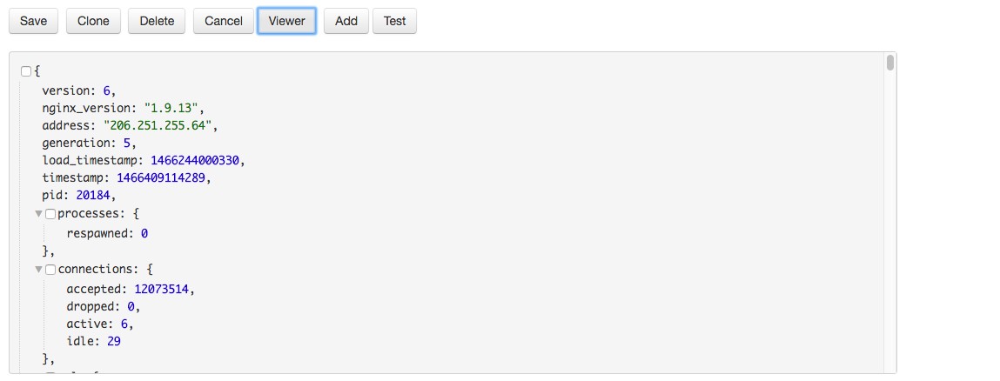

# JSON Job
JSON (Javascript Object Notation) is an open standard protocol that is used primarily to transmit data between the server and application. It is often used as an alternative to XML.

## JSON Configuration

| Field | Description |
|:------------- |:-------------|
| Name  | Configuration name. |

#### Request Fields

| Field | Description |
|:------------- |:-------------|
| HTTP Pool | Pool of HTTP connections to the host. |
| Path | Full URL including HTTP address, path and protocol. |
| Item List | Used to set values into the Path field. For example, the path is set with the template (key ${ITEM}): http://www.test.ru/api/${ITEM}. <br> The key ${ITEM} is also supported by the fields Default Entity, Entity Field, Metric Prefix, and Property Default Type. |
| Replacement Table | Specify one of the existing replacement tables from the list. |
| Payload Method | Type of http request. |
| Payload | Body of HTTP request. |
| Enable Web Driver | Select the check box to enable Web Driver. |
| Driver Script* | Selenium script. |
| Driver Timeout, seconds* | Script timeout in seconds. |
| Driver File Encoding* | Encoding of the file that is requested with the script. |

#### Naming Fields

| Field | Description |
|:------------- |:-------------|
| Default Entity | Entity that will be used in Property/Series commands. |
| Entity Field | Value that will be used as entity in Property/Series commands. | 
| Entity Prefix | Specify entity prefix for Series/Property commands. |
| JSON Path | Specify expression in the JsonPath format to define a root element. Property/Series will be formed basing on elements from this expression. |
| Depth | Depth of element nesting. |
| Custom Tags | Specify custom tags that should be included into Series/Property commands ([example](.#custom-tags)). You can also use keys ${PARENT} (synonym for ${PARENT(1)}), ${PARENT(n)}, ${field_name}. <br> Keys ${PARENT}, ${PARENT(n)} are also supported by the fields Default Entity, Time Value. |

#### Metric Fields

| Field       | Description           |
|:------------- |:-------------|
| Metric Prefix | Specify metric prefix. |
| Included Fields | Specify fields that should be included into the Series command. If you leave the field empty, all values will be included into the command. You can use the '.' symbol for nested fields. |
| Excluded Fields | Specify fields that should be excluded from the Series command. You can use the '.' symbol for nested fields. |
| Renamed Fields | Specify name of fields you want to rename and new names for these fields in the following format: old_name=new_name. |

#### Property Fields

| Field       | Description           |
|:------------- |:-------------|
| Property Type Field | Value that will be used as property type. Expression should be specified in the JsonPath format. |
| Property Default Type | Property type that will be used as a default type for all properties. |
| Property Key Fields | Fields that should be included into the Property command value collection. |
| Property Value Fields | Fields that should be loaded to a collection as properties. |

#### Time Fields

| Field       | Description           |
|:------------- |:-------------|
| Time Field | Field with values that specify time metrics (Series).    |
| Time Value | Used to take value by keys ${PARENT}, ${PARENT(n)} from json that specify time metrics for Series command ([example](.#time-value)).|
| Time Format | Format of the string that contains time values. |
| Time Zone | Time zone of the string that contains time values.  |

## Field Examples

#### Custom Tags

There is a JSON file:

```json
{
  "upstreams": {
    "demo-backend": {
      "keepalive": 0,
      "peers": [
        {
          "active": 0,
          "backup": false,
          "responses": {
            "1xx": 0,
            "2xx": 0,
            "total": 0
          },
          "id": 0,
          "server": "1.2.3.4:1234"
        }
      ]
    }
  }
}
```

If tag is set with template 'server=${server}', then tag 'server=1.2.3.4:1234' will be added to the command.<br>If tag is set with template 'name=${PARENT}' and field 'JSON Path' is set with value '$upstreams.demo-backend.peers.*', then tag 'name=peers' will be added to the command. Else if tag is set with template 'name=${PARENT(2)}', then tag 'name=demo-backend' will be added. 

#### Time Value

There is a JSON file:

```json
{
  "2016-01-01": {
    "ok": 10,
    "fail": 2
  },
  "2016-01-02": {
    "ok": 15,
    "fail": 2
  }
}
```

If value is set with template '${PARENT}' and field 'JSON Paht' is set with value '$.*', then fields '2016-01-01' and '2016-01-02' will be used as time for metrics (Series). 

## Configuration Example


## JSON Viewer Example


